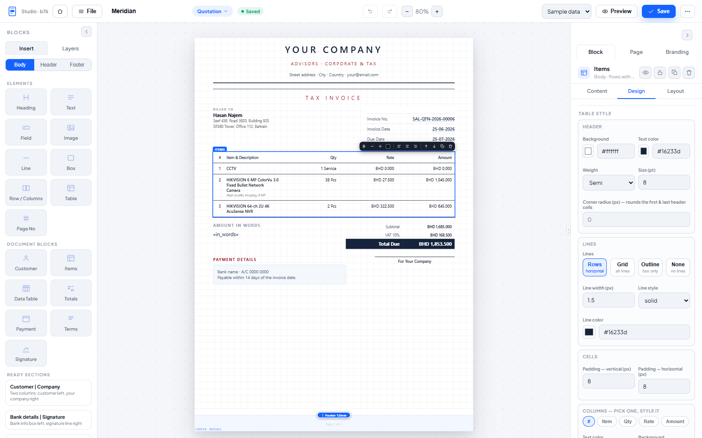
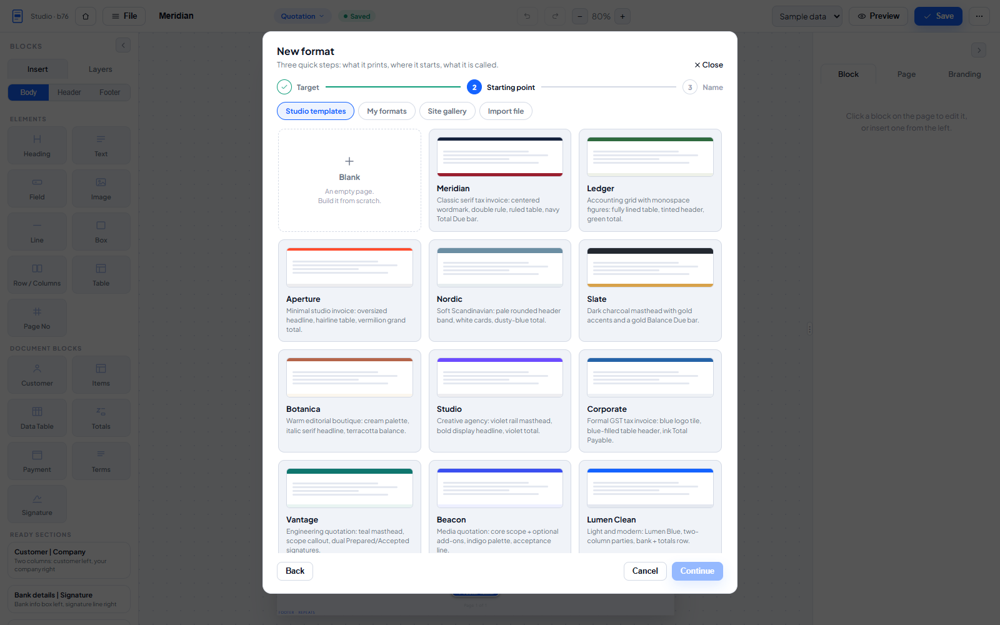
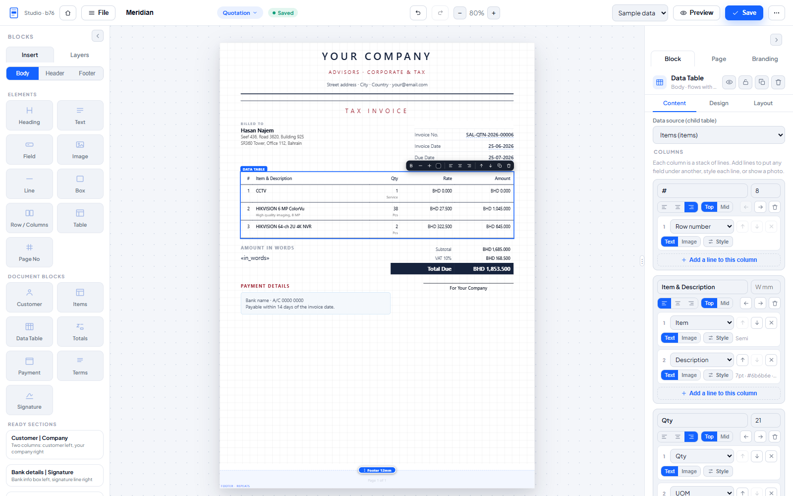
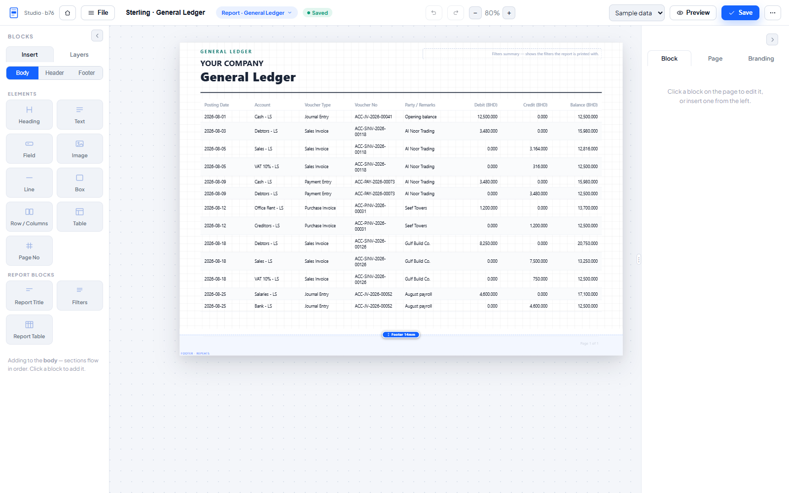
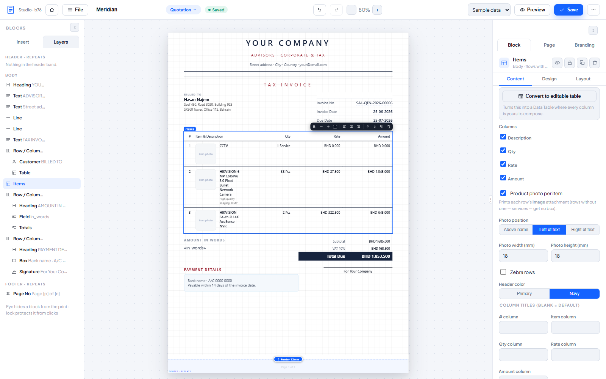

# LumenPDF Studio

**A visual print-format builder for Frappe / ERPNext v14, v15 and v16.** Design pixel-perfect, branded PDFs
for your documents *and* your reports — with drag-and-drop blocks, ready-made templates, live
preview, and zero code.



| | |
|---|---|
|  |  |
|  |  |

## Why

Frappe's stock print formats make beautiful branded output hard: full-bleed banners, exact
margins, repeating headers/footers with real page numbers, background colors that actually
print, and clean RTL/Arabic all fight the default PDF pipeline. LumenPDF Studio renders through
the host's own Chromium PDF generator (with automatic engine fallbacks), so what you design is
what prints.

## Highlights

- **Visual builder** (`/app/lumenpdf-builder`): drag blocks onto an A4 canvas — headings, text,
  bound document fields, images, dividers, boxes, multi-column rows, custom tables, page
  numbers — plus smart blocks for items, totals, taxes, payment schedule, customer, terms and
  signature. Undo/redo, autosave drafts, inline editing, zoom, full-screen, dark mode.
- **Documents and reports**: brand any DocType's print format, and any Query/Script report
  (General Ledger, Trial Balance, …) — portrait or landscape, with a dynamic report table whose
  columns you choose or inherit from the report.
- **Ready-made templates**: 10 invoice/quotation designs and 8 financial report formats, each a
  complete starting point you can restyle freely. Publish your own formats to a site-wide
  gallery, export/import them as JSON, and save any configured block to a reusable **block
  library** ("My blocks") you can insert into any format.
- **Product-catalog documents**: per-item **product photos** in the items table, pulled from
  each row's Image attachment, sized how you want — rows without a photo (services) get no box.
- **Branding that scales**: per-company colors, fonts and banner images (LumenPDF Settings), with
  per-format overrides and opt-outs. Bilingual EN/AR out of the box: a document picks a Latin
  font AND an Arabic font, so Arabic prints in the face you chose instead of the server's
  fallback. 16 Arabic Google fonts, naskh and modern sans, plus RTL-aware blocks.
- **Deep data binding**: any field of the document (including custom fields), one-hop linked
  fields (e.g. the customer's email on a Sales Invoice), any child table as a styled data table,
  conditional block visibility, conditional watermarks (e.g. status = Paid → "PAID"),
  amount-in-words.
- **Wired into ERPNext flows**: replace the native Print → PDF per doctype, a "Download Branded
  PDF" button with a format chooser, auto-attach the branded PDF on submit, a "Branded PDF"
  button on every report, and optional branding of native report PDFs.
- **Multi-page correctness**: repeating header/footer bands with real page numbers, row-aware
  pagination, and a compose pipeline that keeps flowing content clear of the bands on every page.
- **In-app feedback**: a 💬 button in the builder emails feedback (with site/user/version
  context) straight to the maintainers via the site's own outgoing email.

- **QR codes, bilingual tables and tinted stationery.** A QR block generates the code at print
  time (ZATCA tax-invoice payload, any field, or fixed text) with no extra dependency, table
  headers can stack two languages, and a page background colour prints behind every page.
  Two ready starters use all of it: *Tax Invoice EN·AR* and *Merchant Statement EN·AR*.

- **A design copilot (Gemini).** Describe a change in plain language, ask for a whole new
  format, or drop in a picture or PDF of any document and have it rebuilt. Every answer is validated against the block
  schema before it reaches the canvas, and one Ctrl+Z puts the page back. Bring your own key.
- **Page control.** Side margins are adjustable per format (edge-to-edge bands are possible),
  on top of the page background colour.

## Branches

- `version-16` is the Frappe/ERPNext **v16** branch. Its CI installs the app on a real v16
  bench on every push.
- `lumenpdf` serves **v14 and v15** and carries the same code.

## Requirements

- Frappe **v14, v15 or v16** (works with or without ERPNext; ERPNext unlocks the document
  smart blocks). On v14 the engine renders through wkhtmltopdf automatically; on v15/v16 and
  Frappe Cloud it reuses the host's Chromium generator - the self-probe picks the right path
  per site.
- No extra services and no hard Python dependencies: the default engine reuses the site's own
  Chromium PDF generator, and the landscape fallback uses wkhtmltopdf, which Frappe ships.

## Install

```bash
bench get-app https://github.com/ma7mod7osam/LumenPDF-Studio --branch lumenpdf
bench --site <your-site> install-app lumenpdf
bench --site <your-site> migrate
```

The app configures itself on install and on every migrate (its config DocTypes are created automatically; a starter
Quotation format is seeded on ERPNext sites). On Frappe Cloud, add the app to your bench and
deploy.

## Quick start

1. Open **LumenPDF Studio** (`/app/lumenpdf-builder`) as a System Manager.
2. Pick a target: a **Document** type (Quotation, Sales Invoice, …) or a **Report**.
3. Start from **▦ Templates** or a blank canvas; drag blocks, bind fields, style everything.
4. **✓ Save** — then print: the document's **Download Branded PDF** button, the report's
   **Branded PDF** button, or (if enabled per mapping) the native **Print → PDF** itself.
5. Manage defaults per doctype/company in **File → Open / manage formats**.

Company-wide branding (colors, fonts, header/footer banner images) lives in **LumenPDF
Settings** — one row per company. Formats inherit it and can override or suppress it.

## PDF engines

| Engine | When | Notes |
|---|---|---|
| `frappe_chrome` (default) | Always available | Reuses the host's own Chromium PDF generator; zero setup. |
| wkhtmltopdf fallback | Automatic | Used when the host's chrome generator can't produce landscape pages — detected and cached automatically. |
| `playwright` / `gotenberg` | Opt-in | Set `lumenpdf_engine` in site_config; install the matching optional dependency (`pip install lumenpdf[playwright]`). |

Diagnostics: `/api/method/lumenpdf.api.engine_diag` (System Manager) reports how the active
engine treats margins, full-bleed and landscape.

## Security posture

- Builder and format management are **System Manager only**; standard templates are read-only.
- Formats can only reference **uploaded site files** for images (no remote URLs — SSRF-safe),
  and remaining remote references are neutralized before rendering.
- Permission-gated fields (`permlevel > 0`) are never offered in the builder and never render,
  including via linked fields and child tables. Linked-field hops require read permission on
  the target doctype. Report renders enforce the report's own permissions.
- Renders are serialized behind a lock so the PDF endpoint can't be used to stack Chromium
  processes.

## Licence

**Proprietary. Copyright (c) 2026 Lumen Solutions (BSTC W.L.L). All rights reserved.**

This repository is public so that Frappe Cloud can build and distribute the app, and so you
can read exactly what runs on your site. **It is not open source.** Being able to read the
source does not grant a right to copy, redistribute or resell it. See `license.txt`.

Releases up to v1.4.0 were MIT, and two commits on 2026-09-13 were briefly AGPL-3.0; those
grants stand for whoever obtained them then. See the Licence History in `license.txt`.

"LumenPDF Studio" and the LumenPDF logo are trademarks of Lumen Solutions and are not covered by
any code licence. See `TRADEMARKS.md`.
